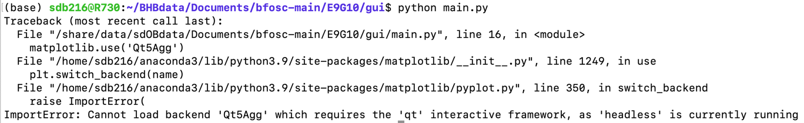

# 216telescope
## 本地处理

b站：[216望远镜光谱数据处理教程](https://www.bilibili.com/video/BV1o24y1p77a/?spm_id_from=333.999.0.0&vd_source=1f85b66aea0aa541bef3c423adf160b3)

环境要求：
```shell
pip install laspec
pip install pyraf
pip install lightkurve==1.11.3
pip install -U git+git://github.com/hypergravity/songcn
```

前人的肩膀：
```shell
git clone https://github.com/lidihei/pyrafspec.git
cd pyrafspec
pip install .
rm -rf build pyrafspec.egg-info

git clone https://github.com/hypergravity/bfosc.git
```

服务器数据下载：
```shell
scp -r sdb216@10.3.10.45:/home/sdb216/BHBdata/216BFOSC_ORIGINAL/BHB_216/20240105_bfosc/ /Users/sara/PycharmProjects/216telescope/data/
```

## 服务器处理（推荐）

### 抽谱
```shell
cd BHBdata/Documents/bfosc-main/E9G10/gui
python main.py
```
数据路径在 `/home/sdb216/sdOBdata/216BFOSC/BHB_216/`
处理完成后显示 `[6.0] make stats for the FEAR solutions`
特别注意是否有 fear_*.dump 被 skipped，如果被跳过则手动复制时间相近的并重命名来补齐

服务器运行程序报错：

解决：
mac 安装 XQuartz, 使用 `ssh -XY name@ip` 连接

### 拼接光谱
jupyter路径：`BHBdata/Documents/pyrafspec/tutorial/bfoscE9G10_extract_splicing.ipynb`
最终获得一堆 `*_splicing.fits` 文件，最后`rm *.fit` 删除原始文件。


